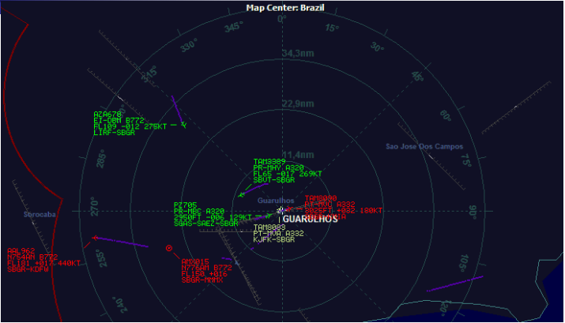

# Trabalho final da disciplina de Computação Gráfica:

###### Este repositório tem como objetivo organizar e centralizar as rotinas implementadas pelos 3 participantes do grupo a fim de produzir um sistema de radar simples e conseguir aprovação na disciplina de C.G da universidade uniCEUB.

## Rotinas a serem implementadas (versão inicial):

## Checklist:
- [] Primitiva Ponto.
- [] Primitiva Reta.
- [] Círculo.
- [] Avião.
- [] Texto.
- [] Preenche.
