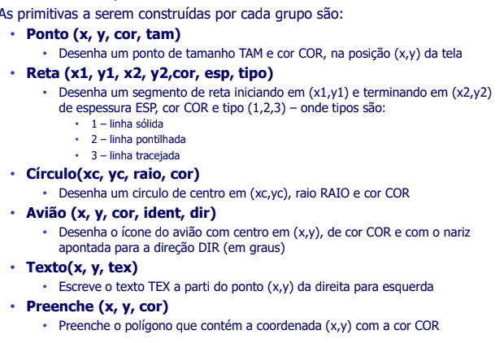

# Trabalho final da disciplina de Computação Gráfica:

###### Este repositório tem como objetivo organizar e centralizar as rotinas implementadas pelos 3 participantes do grupo a fim de produzir um sistema de radar simples e conseguir aprovação na disciplina de C.G da universidade uniCEUB.

## Rotinas a serem implementadas (versão inicial):

## Dependencias deste projeto:

- graphics.py==5.0.1.post1
- virtualenv==20.0.17

instale o graphics.py:
**pip install graphics.py**

instale a virtualenv de acordo com seu sistema operacional, para iniciar, 
entre na raiz do projeto no seu sistema e faça:
 
**source ambiente_cg.py/bin/activate**

## Checklist:

- [X] Primitiva Ponto

- [ ] Primitiva Reta

- [ ] Circulo

- [ ] Aviao

- [ ] Texto

- [ ] Preenche
